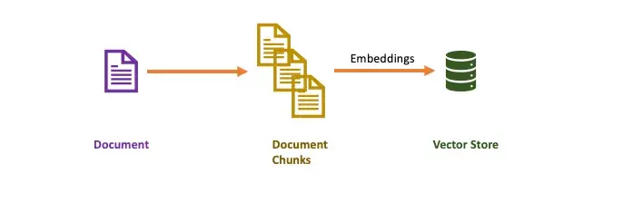
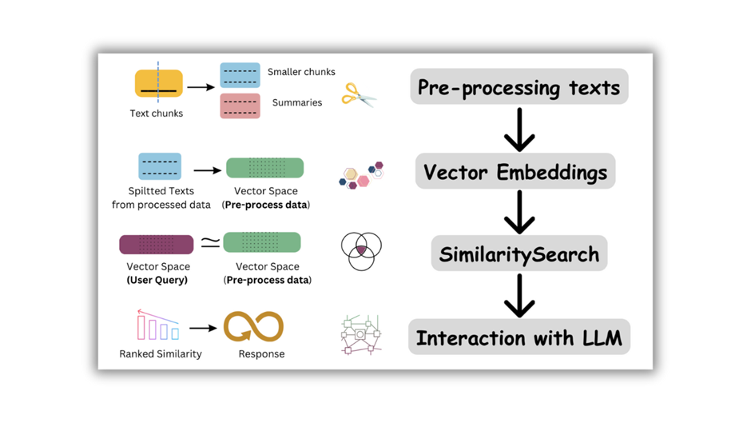
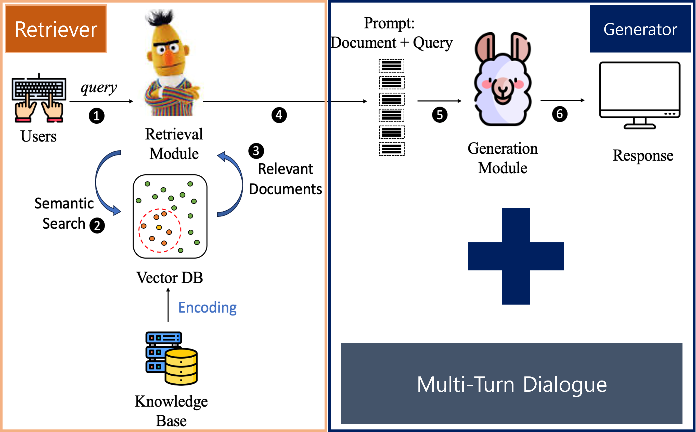
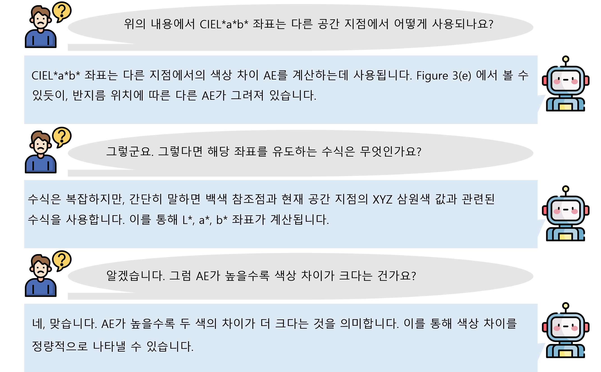
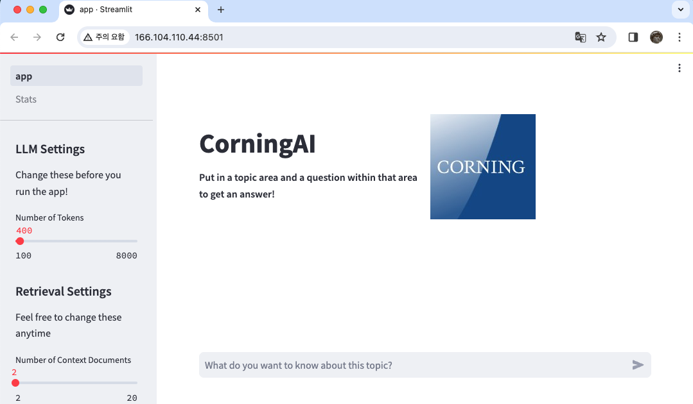
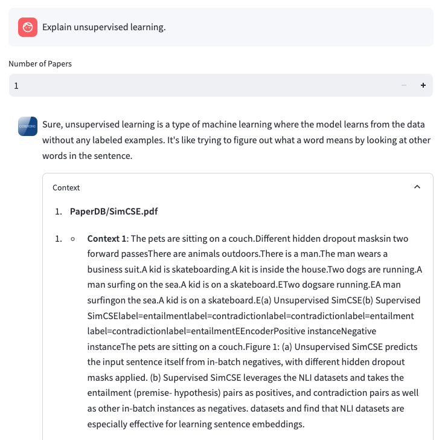
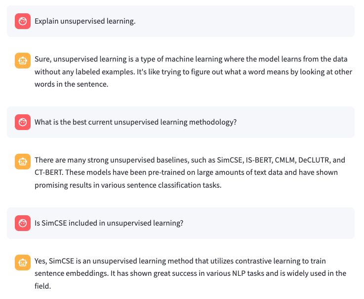

<div align="center">
    <a href="https://github.com/CrayLabs/SmartSim"></a>
</div>

# Corning AI : Multi-turn 대화가 가능한 대화 챗봇 📖

Welcome to **ClosedAI-chatbot**. 해당 repo는 LangChain과 ChromaDB를 활용하여 대화를 가능하게 합니다. 

## 📖 How it Works

아래 그림은 **"ClosedAI-chatbot"** 가 작동하는 과정을 보여줍니다. 사용자는 대화하고자 하는 주제를 입력하고, 해당 주제를 기반으로 논문을 검색합니다. 그런 다음 이 논문들은 더 작은 부분으로 청크되어 임베딩이 생성됩니다. 이러한 임베딩은 벡터 데이터베이스로 사용되는 ChromaDB에 저장됩니다. 그러면 사용자는 제출한 주제에 관련하여 검색된 논문에 대해 대화할 수 있고, 챗봇은 가장 관련성이 높은 답변을 반환합니다.


## 🛠 Components

1. **LangChain's ArXiv Loader**: PaperDB에 대화에 필요한 문서를 기반으로 불러옵니다.
2. **Chunking + Embedding**: LangChain을 사용하여 긴 논문을 관리 가능한 조각(현재는 다소 임의로)으로 분할한 다음 임베딩을 생성합니다.
3. **ChromaDB**: RAG를 위한 빠르고 효율적인 벡터 저장, 인덱싱 및 검색을 시연합니다.
4. **RetrievalQA**: LangChain의 RetrieveQA 및 Local LLM을 기반으로 사용자는 제출한 주제별로 검색된 논문에 대한 쿼리를 작성할 수 있습니다.
    
    1) Retrieval 모델
       - 문서 임베딩을 위한 모델 : "BAAI/bge-base-en-v1.5"

            아래와 같은 흐름으로 Retrieval 모델을 활용하여 문서를 임베딩합니다.
        
       
    2) LLM 모델
       - 코닝 도메인에 학습한 LLM 모델 : "nayohan/closedai-llm"
            학습의 전체 프레임워크는 다음과 같습니다.
        


        - 궁극적으로 저희 모델은 단순한 QA보다는 상호간의 지속적인 대화가 가능한 QA 모델을 학습했습니다.


        


    
    


5. **Python Libraries**: Making use of tools such as [`ChromaDB`], [`Langchain`](https://www.langchain.com/), [`Streamlit`](https://streamlit.io/), etc


### Run Locally

1. First, clone this repo and cd into it.
    ```bash
    $ https://github.com/CORNING-AI-CHALLENGE/team_closed_AI.git && cd team_closed_AI/app
    ```

2. Create your env file:
    ```bash
    $ conda create -n <env_name> python=3.10
    ```

3. Install dependencies:
    You should have Python 3.10+ installed and a virtual environment set up.
    ```bash
    $ pip install -r requirements.txt
    ```

4. 대화 주제에 관련하여 필요한 문서를 해당 경로에 업로드 해줍니다. **(PDF만을 지원합니다)**
    ```bash
    $ PaperDB/*.pdf

    ```

5. Run the app:
    ```bash
    $ streamlit run app.py
    ```

6. Navigate to:
    ```
    http://localhost:8501/
    ```
### 활용 예시


1. 시작 페이지
    - 토픽 주제에 대해 먼저 입력합니다.

    

2. 대화 페이지
    - 질문을 입력하면 답변과 관련 context를 보여줍니다.
   
    

3. 멀티 턴 대화 예시
    
    

